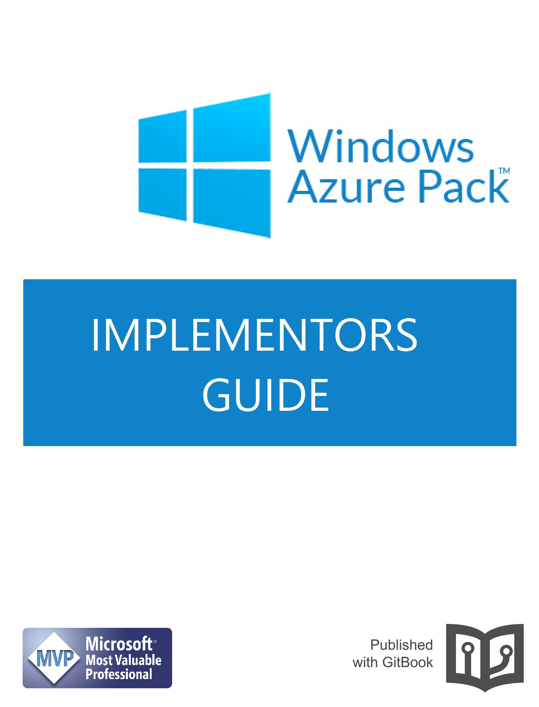

# Windows Azure Pack

Welcome to the Windows Azure Pack implementors guide. While the primary objective of this guide is to help you implement a fully operational Windows Azure Pack environment, the approach we are going to use, is coupled on the concept of IT Service deliver, and many sections of this book should prove to be a useful resource as you set about implementing and delivering additional services for your IT environment.

We will make no assumptions to your current environment; and start from a blank canvas, you as the ready then have the opportunity to model the design suggestions based on your own requirements and existing infrastructure.

We will begin by explaining some background details related to the hosting forest, including some important considerations related to best practices which has evolved based on community feedback and learning. We will then move on to providing an overview on the key components which participate in a Windows Azure Pack deployment, while illustrating there communication paths and protocols.

At the end of this book you should be in a position to deliver a Windows Azure Pack service, and all its dependent services, and be positioned to maintain a continued process improvement approach.

